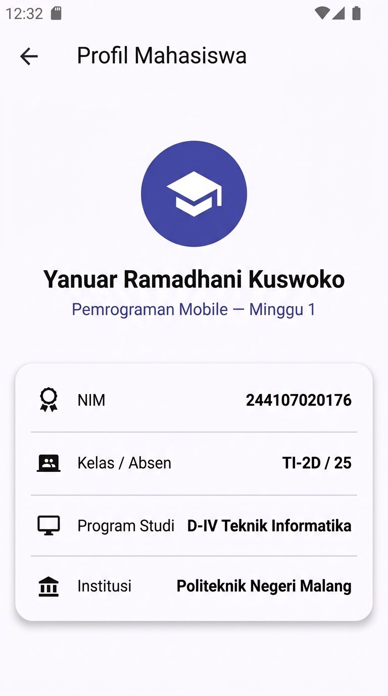

# #01 | Mobile Development Ecosystem & Flutter Refresh

**Mata Kuliah:** Pemrograman Mobile  
**Minggu:** 01  
**Topik:** Mobile Development Ecosystem & Flutter Refresh  

---

## Identitas Mahasiswa

| Informasi | Keterangan |
|---|---|
| **Nama** | Yanuar Ramadhani Kuswoko |
| **NIM** | 244107020176 |
| **Kelas / Absen** | TI-2D / 25 |
| **Program Studi** | D-IV Teknik Informatika |
| **Jurusan** | Teknologi Informasi |
| **Institusi** | Politeknik Negeri Malang |

---

## 🎯 Tujuan Pembelajaran

Setelah menyelesaikan codelab dan praktikum pada minggu ke-1 ini, mahasiswa mampu:
1. Menjelaskan evolusi pengembangan mobile serta perbedaan mendasar antara pendekatan **Native**, **Hybrid**, dan **Cross-Platform**.
2. Menjelaskan arsitektur Flutter (Framework, Engine, Embedder), peran bahasa pemrograman Dart, struktur proyek, dan konsep dasar *Widget Tree*.
3. Mengulang dan menguasai dasar-dasar bahasa Dart: variabel, tipe data, fungsi, class (*OOP*), dan fitur *Null Safety*.
4. Menyiapkan environment Flutter SDK, Android SDK, verifikasi perangkat (*emulator* / perangkat fisik), serta menjalankan aplikasi pertama.
5. Memodifikasi UI default Flutter menjadi aplikasi profil mahasiswa dan mendokumentasikannya ke dalam repository portfolio Git.

---

## 📋 Checklist Tugas Mingguan

- [x] **Setup & Verifikasi Environment:** Menjalankan `flutter doctor` dan `flutter devices` untuk memastikan kesiapan SDK dan perangkat.
- [x] **Dart Refresh (Latihan Mandiri):**
  - [x] Membuat fungsi `hitungLuasPersegiPanjang` dengan parameter bertipe `double`.
  - [x] Membuat class `Profil` dengan properti `nama`, `nim`, dan `email` nullable (`String?`).
  - [x] Memanggil fungsi dan class dari `main()` serta mengimplementasikan penanganan null safety pada `email` secara aman.
  - [x] Menyusun unit test untuk Dart Refresh (`test/dart_refresh_test.dart`).
- [x] **Praktikum Aplikasi Profil Mahasiswa:**
  - [x] Menginisialisasi proyek Flutter pada folder `01-week-1-mobile-development-ecosystem-flutter-refresh/`.
  - [x] Mengubah `lib/main.dart` menjadi aplikasi profil mahasiswa.
  - [x] Menambahkan widget NIM dan informasi tambahan (Kelas, Program Studi, Institusi) menggunakan widget dasar.
  - [x] Menyusun widget test (`test/widget_test.dart`).
- [x] **Dokumentasi & Portofolio:**
  - [x] Menyimpan screenshot hasil eksekusi aplikasi di folder `screenshots/`.
  - [x] Mendokumentasikan kendala setup yang ditemui beserta solusinya.
  - [x] Menjawab pertanyaan refleksi pembelajaran secara komprehensif.

---

## 📚 Rangkuman Materi Pembelajaran

### 1. Evolusi Pengembangan Mobile

Pengembangan aplikasi mobile berkembang pesat melalui beberapa pendekatan arsitektur:

| Pendekatan | Ciri Utama & Arsitektur | Kelebihan | Kekurangan | Contoh Teknologi |
|---|---|---|---|---|
| **Native** | Kode dan UI dibangun spesifik untuk satu OS menggunakan API platform langsung. | Performa tertinggi, akses hardware instan & penuh, kepatuhan UX platform sempurna. | Biaya & waktu pengembangan ganda (harus maintain 2 basis kode terpisah). | Kotlin/Java (Android), Swift/Obj-C (iOS) |
| **Hybrid** | Aplikasi web (HTML/CSS/JS) yang dibungkus (*wrapped*) dalam WebView native. | Satu basis kode web, cepat dibuat, biaya relatif rendah. | Performa lebih lambat, animasi kurang mulus, akses API hardware terbatas melalui plugin bridge. | Apache Cordova, Ionic, PhoneGap |
| **Cross-Platform** | Satu basis kode (*single codebase*) yang dikompilasi atau di-render langsung ke native platform. | Produktivitas tinggi, konsistensi UI di multi-platform, performa mendekati native. | Ukuran binary aplikasi sedikit lebih besar, dependensi pada framework untuk fitur platform terbaru. | **Flutter**, React Native |

---

### 2. Arsitektur Flutter dan Peran Dart

Flutter mengusung arsitektur berlapis (*layered architecture*) yang terbagi menjadi 3 tingkatan utama:

```
┌─────────────────────────────────────────────────────────────┐
│  Framework (Dart)                                           │
│  - Material Design & Cupertino Widgets                      │
│  - Rendering Layer, Animation, Painting, Gestures           │
│  - Foundation Services                                      │
├─────────────────────────────────────────────────────────────┤
│  Engine (C / C++)                                           │
│  - Skia / Impeller (Graphics Rendering 2D)                  │
│  - Dart Runtime & Garbage Collector                         │
│  - Text Layout Engine (LibTxt / HarfBuzz)                   │
├─────────────────────────────────────────────────────────────┤
│  Embedder (Platform-Specific: Java/C++/Obj-C)               │
│  - Surface Rendering & Display Configuration                │
│  - Threading Setup & Message Loop Dispatcher                │
│  - Native Plugins & Device Access (Sensors, Camera, dll.)   │
└─────────────────────────────────────────────────────────────┘
```

#### Peran Bahasa Dart:
1. **Dua Mode Kompilasi:**
   - **JIT (*Just-In-Time*):** Digunakan saat fase *development* untuk mendukung fitur **Hot Reload** dan **Hot Restart** secara instan dalam hitungan milidetik.
   - **AOT (*Ahead-Of-Time*):** Digunakan saat build *production/release* untuk mengompilasi kode Dart secara langsung menjadi *ARM/x86 native machine code* sehingga aplikasi berjalan sangat cepat tanpa runtime bridge.
2. **Karakteristik Dart:** Memiliki sistem *sound null safety*, pengetikan statis (*statically typed*) dengan inferensi tipe yang kuat, serta manajemen memori teroptimasi (*generational garbage collection*) yang sangat cocok untuk siklus hidup widget UI yang sering dibuat dan dihancurkan.

---

### 3. Widget Tree dan UI Deklaratif

Dalam Flutter, **UI bersifat Deklaratif**:
$$\text{UI} = f(\text{state})$$
Artinya, tampilan antarmuka merefleksikan state saat ini. Setiap elemen antarmuka di Flutter adalah **Widget** yang disusun dalam struktur hierarki pohon (*Widget Tree*).

Struktur proyek standar Flutter:
- `lib/`: Berisi kode sumber utama aplikasi Dart (titik masuk utama: `lib/main.dart`).
- `test/`: Berisi berkas unit testing dan widget testing.
- `android/`, `ios/`, `web/`, `windows/`: Berisi konfigurasi dan runner spesifik platform.
- `pubspec.yaml`: Berkas konfigurasi metadata, dependensi (*packages*), font, dan aset aplikasi.

---

### 4. Perbedaan Hot Reload vs Hot Restart

| Karakteristik | Hot Reload (`r`) | Hot Restart (`R`) |
|---|---|---|
| **Mekanisme** | Menginjeksikan berkas kode sumber yang baru langsung ke Dart VM yang sedang berjalan dan membangun ulang (*rebuild*) widget tree. | Menginisialisasi ulang seluruh aplikasi dari awal (`main()`) dan mereset Dart VM. |
| **State Aplikasi** | **Dipertahankan (*Preserved*)**; data formulir atau posisi scroll tidak hilang. | **Dihapus / Direset (*Destroyed*)**; kembali ke state awal aplikasi. |
| **Kecepatan** | Sangat cepat (< 500 ms). | Sedikit lebih lambat (~1-3 detik). |
| **Penggunaan Ideal** | Mengubah styling UI, layout widget, padding, warna, dan logika fungsi kecil. | Mengubah inisialisasi `initState()`, mengganti konfigurasi global, modifikasi `main()`, atau menambah dependensi baru. |

---

## 💻 Hasil Implementasi

### A. Latihan Mandiri: Dart Refresh & Null Safety

Berkas implementasi: [`lib/dart_refresh.dart`](file:///d:/mobile/01-week-1-mobile-development-ecosystem-flutter-refresh/lib/dart_refresh.dart)

#### Kode Implementasi:
```dart
// Latihan Mandiri Dart Refresh - Minggu 1
void main() {
  print('=== 1. DASAR DART & FUNGSI SAPA ===');
  String nama = 'Yanuar Ramadhani Kuswoko';
  int semester = 4;
  final bool aktif = true;

  print(sapa(nama, semester));

  final mahasiswa = Mahasiswa(nama: nama, aktif: aktif);
  print('Status Mahasiswa: ${mahasiswa.status()}');

  print('\n=== 2. LATIHAN MANDIRI: HITUNG LUAS PERSEGI PANJANG ===');
  double panjang = 12.5;
  double lebar = 8.0;
  double luas = hitungLuasPersegiPanjang(panjang, lebar);
  print('Panjang: $panjang, Lebar: $lebar');
  print('Luas Persegi Panjang: $luas');

  print('\n=== 3. LATIHAN MANDIRI: CLASS PROFIL & NULL SAFETY ===');
  // Profil dengan email terisi
  final profil1 = Profil(
    nama: 'Yanuar Ramadhani Kuswoko',
    nim: '244107020176',
    email: 'yanuar@example.com',
  );
  print('Profil 1:');
  print('  Nama : ${profil1.nama}');
  print('  NIM  : ${profil1.nim}');
  print('  Email: ${profil1.email?.toUpperCase() ?? 'BELUM DIISI'}');

  // Profil dengan email null
  final profil2 = Profil(
    nama: 'Alya Putri',
    nim: '244107020999',
    email: null,
  );
  print('\nProfil 2 (Email null):');
  print('  Nama : ${profil2.nama}');
  print('  NIM  : ${profil2.nim}');
  print('  Email: ${profil2.email?.toUpperCase() ?? 'BELUM DIISI'}');
}

/// Fungsi sapa
String sapa(String nama, int semester) => 'Halo $nama, semester $semester';

/// Latihan 1: Fungsi hitungLuasPersegiPanjang
double hitungLuasPersegiPanjang(double panjang, double lebar) {
  return panjang * lebar;
}

/// Class Mahasiswa
class Mahasiswa {
  final String nama;
  final bool aktif;

  Mahasiswa({required this.nama, required this.aktif});

  String status() => aktif ? '$nama aktif' : '$nama tidak aktif';
}

/// Latihan 2: Class Profil dengan null safety
class Profil {
  final String nama;
  final String nim;
  final String? email;

  Profil({
    required this.nama,
    required this.nim,
    this.email,
  });

  String getInfo() {
    final emailDisplay = email?.toLowerCase() ?? '(email belum diisi)';
    return 'Mahasiswa: $nama | NIM: $nim | Email: $emailDisplay';
  }
}
```

#### Output Eksekusi Terminal (`dart run lib/dart_refresh.dart`):
```text
=== 1. DASAR DART & FUNGSI SAPA ===
Halo Yanuar Ramadhani Kuswoko, semester 4
Status Mahasiswa: Yanuar Ramadhani Kuswoko aktif

=== 2. LATIHAN MANDIRI: HITUNG LUAS PERSEGI PANJANG ===
Panjang: 12.5, Lebar: 8.0
Luas Persegi Panjang: 100.0

=== 3. LATIHAN MANDIRI: CLASS PROFIL & NULL SAFETY ===
Profil 1:
  Nama : Yanuar Ramadhani Kuswoko
  NIM  : 244107020176
  Email: YANUAR@EXAMPLE.COM

Profil 2 (Email null):
  Nama : Alya Putri
  NIM  : 244107020999
  Email: BELUM DIISI
```

---

### B. Praktikum & Mini Assignment: Aplikasi Profil Mahasiswa

Berkas implementasi: [`lib/main.dart`](file:///d:/mobile/01-week-1-mobile-development-ecosystem-flutter-refresh/lib/main.dart)

Aplikasi telah dikembangkan sesuai arahan codelab dengan mengganti UI default dan menambahkan informasi mahasiswa (Nama, NIM, Kelas/Absen, Program Studi, Institusi) menggunakan kombinasi widget dasar:
- `MaterialApp` & `ThemeData`: Mengatur tema aplikasi dengan Material 3 dan skema warna Indigo.
- `Scaffold`: Struktur halaman dasar dengan `AppBar` bertuliskan **"Profil Mahasiswa"**.
- `Center` & `SingleChildScrollView`: Memastikan konten berada di tengah dan responsif terhadap orientasi layar.
- `Column`: Menyusun elemen profil secara vertikal.
- `Container` & `BoxDecoration`: Membuat wadah ikon bulat (*avatar badge*) untuk ikon `Icons.school`.
- `Card` & `Padding`: Memberikan elevasi dan batas visual yang rapi untuk detail informasi mahasiswa.
- `Row`, `Icon`, `Text`, `Divider`: Menyusun rincian data per baris secara proporsional.

#### Screenshot Tampilan Aplikasi



---

## 🧪 Pengujian (Automated Testing)

Pengujian dilakukan untuk memverifikasi logika Dart Refresh dan rendering UI Flutter.

1. **Dart Unit Test:** [`test/dart_refresh_test.dart`](file:///d:/mobile/01-week-1-mobile-development-ecosystem-flutter-refresh/test/dart_refresh_test.dart)
2. **Widget Test:** [`test/widget_test.dart`](file:///d:/mobile/01-week-1-mobile-development-ecosystem-flutter-refresh/test/widget_test.dart)

#### Hasil Eksekusi `flutter test`:
```text
00:00 +0: loading D:/mobile/01-week-1-mobile-development-ecosystem-flutter-refresh/test/dart_refresh_test.dart
00:00 +0: Latihan Mandiri Dart Refresh Tests sapa returns correct string format
00:00 +1: Latihan Mandiri Dart Refresh Tests Mahasiswa status handles active and inactive correctly
00:00 +2: Latihan Mandiri Dart Refresh Tests hitungLuasPersegiPanjang calculates area accurately
00:00 +3: Latihan Mandiri Dart Refresh Tests Profil handles null safety for email correctly
00:00 +4: Profil Mahasiswa UI render test
00:00 +5: All tests passed!
```

---

## ⚙️ Kendala Setup dan Solusi

Sesuai instruksi mini assignment, berikut adalah kendala setup yang ditemui pada environment beserta langkah penanganannya:

### 1. Kendala Konflik *Multiple ADB Binaries*
- **Deskripsi Kendala:** Saat menjalankan perintah `flutter doctor`, muncul peringatan bahwa terdeteksi dua lokasi binary `adb.exe` yang berbeda pada sistem operasi (lokasi pertama di `D:\Flutter\android-sdk\platform-tools\adb.exe` dan lokasi kedua pada shims package manager Scoop di `C:\Users\YANUAR\scoop\shims\adb.exe`). Konflik ini berpotensi menyebabkan *device detection issue* atau kegagalan komunikasi antara Flutter CLI dengan emulator/perangkat Android fisik.
- **Solusi:** Memastikan urutan path pada variabel lingkungan (*System Environment Variables* `PATH`) mengutamakan Android SDK resmi dari Flutter/Android Studio, serta memastikan daemon ADB yang berjalan di latar belakang menggunakan versi binary yang sinkron melalui perintah:
  ```powershell
  adb kill-server
  adb start-server
  ```

### 2. Konfigurasi Lisensi Android SDK
- **Deskripsi Kendala:** Pada instalasi Android SDK baru, beberapa komponen lisensi build tools belum disetujui sehingga menghambat proses kompilasi target Android.
- **Solusi:** Menjalankan perintah lisensi dan menyetujui seluruh klausul:
  ```powershell
  flutter doctor --android-licenses
  ```

---

## 💭 Refleksi Pembelajaran

### 1. Kapan Native lebih tepat dipilih daripada Cross-Platform?
Pendekatan **Native** (Kotlin/Java untuk Android, Swift untuk iOS) lebih tepat dipilih pada situasi berikut:
- **Aplikasi dengan Kebutuhan Performa Grafis Ekstrem:** Game 3D dengan rendering intensif (*low-level GPU access* seperti Metal/Vulkan) atau aplikasi *Augmented Reality (AR)* / *Virtual Reality (VR)* tingkat lanjut.
- **Akses Fitur Hardware Spesifik & Low-Level API:** Aplikasi yang mengontrol driver periferal khusus, integrasi Bluetooth Low Energy (BLE) berkecepatan tinggi, audio latency sangat rendah (*real-time audio synthesis*), atau fitur sensor eksklusif OS terbaru saat API pihak ketiga belum tersedia di framework cross-platform.
- **Ukuran Binary Minimal & Efisiensi Memori Maksimum:** Sistem embedded atau aplikasi yang memiliki batasan ukuran instalasi sangat ketat (*instant apps*).
- **Ekosistem Aplikasi yang Memanfaatkan Penuh Komponen Native OS:** Misalnya widget layar utama (*home screen widgets*) atau integrasi mendalam dengan sistem notifikasi dan background service khusus OS.

### 2. Bagaimana perubahan state berhubungan dengan widget tree dan UI deklaratif?
Pada paradigma **UI Deklaratif**, pengembang tidak mengubah tampilan secara imperatif (seperti `widget.setText(...)` atau memanipulasi DOM langsung). Sebaliknya:
1. Widget tree adalah deskripsi *immutable* (tidak dapat diubah) dari konfigurasi antarmuka pada suatu titik waktu berdasarkan *State*.
2. Ketika terjadi perubahan data/state (misalnya melalui pemanggilan `setState()` pada `StatefulWidget`), framework Flutter menandai elemen tersebut sebagai *dirty*.
3. Flutter memicu pemanggilan ulang metode `build()`, menciptakan sub-tree widget baru yang merepresentasikan state terkini.
4. Engine Flutter membandingkan (*diffing algorithm*) widget baru dengan widget lama pada *Element Tree*.
5. Hanya bagian yang mengalami perubahan nyata yang akan digambar ulang (*re-rendered*) pada layar fisik secara efisien tanpa perlu merombak seluruh tampilan.

### 3. Mengapa commit kecil dengan pesan jelas bermanfaat bagi pekerjaan tim dan portfolio?
- **Pekerjaan Tim:**
  - Mempermudah proses *Code Review* (Pull Request) karena setiap commit fokus pada satu perubahan atomik yang mudah dipahami.
  - Memudahkan pelacakan bug menggunakan `git bisect` dan meminimalkan resiko *merge conflict*.
  - Mempermudah *revert* fitur yang bermasalah secara terisolasi tanpa mempengaruhi fitur lainnya.
- **Portfolio Profesional:**
  - Riwayat commit yang terstruktur (menggunakan standar konvensi seperti *Conventional Commits*: `feat:`, `fix:`, `docs:`, `test:`, `refactor:`) mencerminkan disiplin teknis dan pemahaman mendalam tentang *version control workflow*.
  - Memperlihatkan proses berpikir, metodologi penyelesaian masalah, dan perkembangan kemampuan teknis (*engineering progress*) secara transparan kepada calon rekan tim atau perekrut industri.

---

## 🚀 Cara Menjalankan Proyek

### 1. Menjalankan Latihan Dart Refresh (Console)
```bash
cd 01-week-1-mobile-development-ecosystem-flutter-refresh
dart run lib/dart_refresh.dart
```

### 2. Menjalankan Aplikasi Flutter (Mobile / Web / Desktop)
```bash
# Menjalankan pada perangkat yang aktif (Chrome / Android / Windows)
flutter run

# Atau spesifik target Chrome (Web)
flutter run -d chrome
```

### 3. Menjalankan Automated Tests
```bash
flutter test
```
