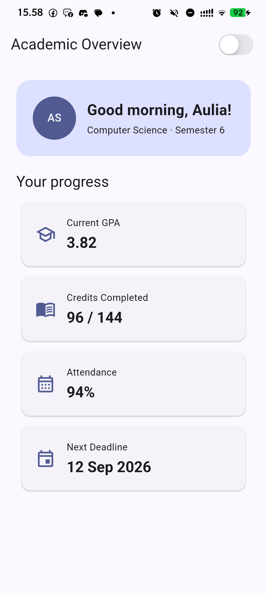
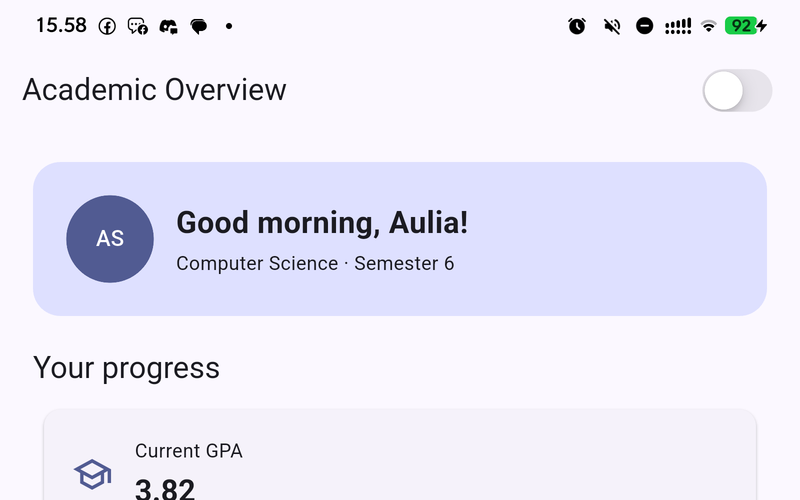

# #02 | Declarative UI & Responsive Design

**Mata Kuliah:** Pemrograman Mobile  
**Minggu:** 02  
**Topik:** Declarative UI, Responsive Layout, Material 3, Cupertino & Accessibility  

---

## Identitas Mahasiswa

| Informasi | Keterangan |
|---|---|
| **Nama** | Yanuar Ramadhani Kuswoko |
| **NIM** | 244107020176 |
| **Kelas / Absen** | TI-2D / 25 |
| **Program Studi** | D-IV Teknik Informatika |
| **Jurusan** | Teknologi Informasi |
| **Institusi** | Politeknik Negeri Malang |

---

## 🎯 Tujuan Pembelajaran

Setelah menyelesaikan codelab dan praktikum pada minggu ke-2 ini, mahasiswa mampu:
1. Menjelaskan prinsip **Declarative UI** dan bagaimana Flutter memetakan hubungan antara *state*, konfigurasi widget, dan *render tree*.
2. Menguasai penggunaan widget dasar layout: `StatelessWidget`, `StatefulWidget`, `Container`, `Row`, `Column`, dan `Expanded`.
3. Membedakan serta mengintegrasikan komponen **Material 3** dan **Cupertino** (misal: `CupertinoSwitch` pada aplikasi bertema Material) untuk kebutuhan pengalaman pengguna yang adaptif.
4. Membangun **Responsive Layout** yang secara otomatis beradaptasi dengan mulus pada berbagai ukuran layar (mobile sempit `< 700px` dan tablet/desktop lebar `≥ 700px`).
5. Mengimplementasikan **Theme**, **Dark Mode dinamis**, styling berbasis `Theme.of(context)`, serta prinsip **Aksesibilitas dasar** (`Semantics`).
6. Melakukan *refactoring* modular (*clean code*) dan menyusun *widget testing* untuk memverifikasi perilaku responsif aplikasi.

---

## 📋 Checklist Tugas Mingguan

- [x] **Praktikum 1 (Warm-up Layout):**
  - [x] Membuat kartu profil mahasiswa dengan `Container`, `Row`, `Column`, `CircleAvatar`, dan `Expanded`.
  - [x] Eksperimen penghapusan `Expanded` dan observasi *overflow*.
  - [x] Eksperimen modifikasi `mainAxisSize` pada `Column`.
  - [x] Menambahkan baris email dengan pola `Row` + `Expanded`.
- [x] **Praktikum 2 (Dashboard Responsif & Theme Toggle):**
  - [x] Menginisialisasi proyek Flutter `responsive_dashboard`.
  - [x] Membangun `DashboardApp` dengan dukungan Material 3, `colorSchemeSeed: Colors.indigo`, dan `darkTheme`.
  - [x] Mengimplementasikan `LayoutBuilder` dan `GridView.count` adaptif (1 kolom di layar sempit, 2 kolom di layar lebar).
  - [x] Mengubah root widget menjadi `StatefulWidget` dengan state `isDark` dan kontrol `CupertinoSwitch` di `AppBar`.
- [x] **Tugas Utama (Academic Overview):**
  - [x] Menambahkan `ProfileHeader` terstruktur dengan identitas mahasiswa.
  - [x] Menampilkan minimal 6 kartu informasi akademik (`Assignments`, `Attendance`, `Portfolio`, `Current week`, `IPK Kumulatif`, `Total SKS`).
  - [x] Menerapkan label aksesibilitas (`Semantics`) pada toggle tema, header profil, dan kartu ringkasan.
- [x] **Refactoring Challenge:**
  - [x] Ekstraksi kartu informasi ke widget reusable `InfoCard` tanpa duplikasi kode.
  - [x] Mengikat seluruh warna dan tipografi secara dinamis ke `Theme.of(context)`.
  - [x] Mendefinisikan konstanta named breakpoint `const double kWideBreakpoint = 700.0;`.
  - [x] Memastikan `flutter analyze` bersih (0 issues/warnings).
- [x] **Testing & Verifikasi:**
  - [x] Menyusun widget test di `test/widget_test.dart` menguji breakpoint sempit & lebar, interaksi switch dark mode, dan rendering identitas.
  - [x] Memastikan seluruh test lulus (`flutter test`).
- [x] **AI Prompt Challenge & Refleksi:**
  - [x] Menyelesaikan AI Prompt Challenge (Prompt Desain, Penguatan Konsep, Verifikasi Audit).
  - [x] Menjawab seluruh pertanyaan refleksi secara komprehensif.

---

## 📚 Rangkuman Materi Pembelajaran

### 1. Paradigma Declarative UI vs Imperative UI

Pada paradigma **Imperative UI** (seperti Android Native Java/Kotlin dengan XML atau DOM Manipulation di Web tradisional), developer harus mengambil referensi view secara manual (`findViewById`, `document.getElementById`) lalu memanggil method mutator (misal `setText()`, `setVisibility()`) langkah demi langkah. Pendekatan ini rentan terhadap *inconsistent state* dan sulit di-*maintain* saat antarmuka semakin kompleks.

Sebaliknya, Flutter menggunakan pendekatan **Declarative UI**:

$$\text{UI} = f(\text{state})$$

Kode mendeklarasikan bagaimana antarmuka harus terlihat untuk nilai *state* tertentu. Ketika *state* berubah (misal pemanggilan `setState()`), Flutter akan membangun ulang (*rebuild*) subtree widget yang terpengaruh dan secara efisien memperbarui *Element Tree* serta *RenderObject Tree*.

```
┌───────────────────────────────────────────────────────────┐
│                    Declarative Pipeline                   │
│                                                           │
│   [ State: isDark = true ] ──► build(context)             │
│                                   │                       │
│                                   ▼                       │
│                          Widget Tree (Immutable)          │
│                                   │                       │
│                                   ▼                       │
│                          Element Tree (Lifecycle)         │
│                                   │                       │
│                                   ▼                       │
│                          RenderObject Tree (Painting)     │
└───────────────────────────────────────────────────────────┘
```

---

### 2. Widget Dasar Layout Flutter

| Widget | Karakteristik & Kegunaan Utama |
|---|---|
| `StatelessWidget` | Widget yang konfigurasinya bersifat statis / tidak memiliki internal state yang berubah selama lifecycle. |
| `StatefulWidget` | Widget yang memiliki objek `State` terpisah yang dapat bertahan melintasi *rebuild* dan memicu pembaruan tampilan via `setState()`. |
| `Container` | Widget serbaguna yang menggabungkan properti *sizing*, *padding*, *margin*, *decoration* (border, shadow, radius), dan penataan *child*. |
| `Row` & `Column` | Widget *Flex layout* untuk menyusun *children* secara horizontal (`Row`) atau vertikal (`Column`). |
| `Expanded` | Widget yang memaksa *child*-nya untuk mengambil sisa ruang yang tersedia (*available flex space*) di dalam `Row` atau `Column`. |
| `LayoutBuilder` | Widget yang menyediakan `BoxConstraints` dari *parent* secara langsung saat *layout phase*, memungkinkan pembuatan keputusan UI adaptif. |

---

### 3. Material 3 dan Cupertino Integration

Flutter mendukung kedua sistem desain terkemuka:
- **Material 3 (M3):** Desain default lintas platform dengan fitur palet dinamis `colorSchemeSeed`, komponen modern (*Card with border*, *AppBar* terintegrasi), dan elevasi berbasis tonal.
- **Cupertino:** Desain khas iOS dengan komponen bergaya *Human Interface Guidelines* (seperti `CupertinoSwitch`, `CupertinoPageRoute`).

Dalam praktikum ini, `CupertinoSwitch` disematkan pada `AppBar` aplikasi Material 3 untuk mendemonstrasikan fleksibilitas Flutter dalam memadukan widget lintas pustaka desain sesuai kebutuhan pengalaman pengguna.

---

### 4. Strategi Responsive Layout

Untuk membuat layout yang adaptif terhadap berbagai orientasi dan form factor layar, kita menggunakan **Breakpoint Strategy**:

```dart
const double kWideBreakpoint = 700.0;

LayoutBuilder(
  builder: (context, constraints) {
    final bool isWide = constraints.maxWidth >= kWideBreakpoint;
    final int columns = isWide ? 2 : 1;
    // Render GridView atau Column sesuai jumlah kolom
  },
)
```

- **Layar Sempit (`< 700px`):** Menggunakan 1 kolom vertikal agar kartu informasi mudah dibaca dengan satu tangan (*one-handed mobile navigation*).
- **Layar Lebar (`≥ 700px`):** Menggunakan 2 kolom grid agar memanfaatkan ruang horizontal secara proporsional tanpa menghasilkan kartu yang terlalu memanjang (*stretched*).

---

## 💻 Implementasi Praktikum

### 1. Praktikum Warm-up: Kartu Profil Sederhana (`lib/warmup_profile.dart`)

Latihan awal bertujuan memahami interaksi antara `Container`, `Row`, `Column`, `CircleAvatar`, dan `Expanded`.

```dart
// Snippet Inti Kartu Profil Mahasiswa
Container(
  width: 320,
  padding: const EdgeInsets.all(16),
  decoration: BoxDecoration(
    color: Colors.indigo.shade50,
    borderRadius: BorderRadius.circular(16),
  ),
  child: Column(
    mainAxisSize: MainAxisSize.min,
    children: [
      Row(
        children: [
          const CircleAvatar(child: Icon(Icons.person)),
          const SizedBox(width: 12),
          Expanded(
            child: Column(
              crossAxisAlignment: CrossAxisAlignment.start,
              children: const [
                Text('Nama Mahasiswa', style: TextStyle(fontWeight: FontWeight.bold)),
                Text('Yanuar Ramadhani Kuswoko'),
              ],
            ),
          ),
        ],
      ),
      const SizedBox(height: 12),
      const Row(children: [
        Expanded(child: Text('NIM')),
        Text('244107020176'),
      ]),
      const SizedBox(height: 8),
      const Row(children: [
        Expanded(child: Text('Kelas')),
        Text('TI-2D / 25'),
      ]),
      const SizedBox(height: 8),
      const Row(children: [
        Expanded(child: Text('Email')),
        Text('yanuar.kuswoko@student.polinema.ac.id'),
      ]),
    ],
  ),
)
```

#### Hasil Eksperimen Warm-up:
1. **Menghapus `Expanded` pada baris nama:**  
   Ketika `Expanded` dihapus pada `Column` nama di dalam `Row`, teks nama yang panjang tidak memiliki batasan lebar maksimum dan mencoba mengambil lebar alami (*intrinsic width*). Jika teks melebihi sisa ruang `Row`, Flutter akan melempar *Yellow-Black Striped Box (Right Overflow Warning)*.
2. **Mengubah `mainAxisSize: MainAxisSize.min`:**  
   Ketika `mainAxisSize` diubah kembali ke default (`MainAxisSize.max`), `Column` akan memanjang vertikal memenuhi seluruh tinggi yang disediakan *parent* (`Center` / `Scaffold`), sehingga kartu profil menjadi sangat tinggi dan tidak proporsional.
3. **Menambahkan baris `Email`:**  
   Dengan menambahkan baris baru menggunakan kombinasi `Row` dan `Expanded(child: Text('Email'))`, label 'Email' akan mengambil ruang di sebelah kiri sedangkan nilai email akan otomatis terdorong rata kanan (*right-aligned*).

---

### 2. Tugas Utama: Academic Overview Responsive Dashboard (`lib/main.dart`)

Aplikasi final mengintegrasikan arsitektur modular, penyesuaian tema Material 3 terang dan gelap, toggle `CupertinoSwitch`, header profil mahasiswa, serta 6 kartu ringkasan akademik.

#### Struktur File Proyek:
```
02-week-2-declarative-ui-responsive-design/
├── lib/
│   ├── main.dart             # Aplikasi Final Academic Overview
│   └── warmup_profile.dart   # Aplikasi Latihan Awal (Warm-up)
├── test/
│   └── widget_test.dart      # Widget & Responsiveness Automated Tests
├── screenshots/              # Folder Penyimpanan Tangkapan Layar
│   └── .gitkeep
├── pubspec.yaml              # Konfigurasi Dependensi Flutter
├── analysis_options.yaml     # Aturan Linter & Static Analysis
└── README.md                 # Laporan Praktikum & Refleksi Lengkap
```

#### Komponen Utama yang Diterapkan:
1. **`DashboardApp` (`StatefulWidget`):** Mengelola state `isDark` dan menyediakan konfigurasi `theme`, `darkTheme`, serta `themeMode` berbasis `colorSchemeSeed: Colors.indigo`.
2. **`ProfileHeader` (`StatelessWidget`):** Menggunakan `Container` dengan radius, `CircleAvatar`, `Row`, `Expanded`, dan tipografi dinamis yang otomatis beradaptasi dengan kontras tema aktif.
3. **`InfoCard` (`StatelessWidget`):** Widget kartu reusable dengan *icon bubble*, judul, subjudul, dan nilai metrik utama yang terikat pada `Theme.of(context)`.
4. **`LayoutBuilder` & `GridView.count`:** Menghitung jumlah kolom berdasarkan `maxWidth >= kWideBreakpoint (700.0)`.
5. **`Semantics`:** Membungkus elemen interaktif (switch tema, profil, dan kartu informasi) dengan label suara yang ramah pembaca layar (*screen reader*).

---

## 🤖 AI Prompt Challenge & Audit

### 1. Prompt Desain

> **Prompt:**  
> *"Bandingkan dua tata letak dashboard akademik untuk Flutter: versi `GridView` dan versi `LayoutBuilder` + `Column`. Jelaskan trade-off responsif dan aksesibilitasnya."*

#### Analisis & Trade-off:

| Aspek | Pendekatan `GridView.count` | Pendekatan `LayoutBuilder` + `Column` / `Flex` |
|---|---|---|
| **Kelebihan Responsif** | Mengatur jumlah kolom dan rasio aspek (`childAspectRatio`) secara otomatis dalam bentuk grid 2 dimensi. Sangat rapi untuk koleksi kartu dengan ukuran seragam. | Kontrol penuh atas tata letak individual setiap elemen baris, tinggi kartu dapat menyesuaikan isi konten (*dynamic height*) tanpa terikat rasio kaku. |
| **Kekurangan Responsif** | Nilai `childAspectRatio` bersifat tetap; jika teks kartu terlalu panjang pada layar dengan lebar perantara, dapat berisiko *vertical overflow*. | Memerlukan logika pembagian *chunk* baris manual (`Row` + `Expanded`) untuk menyusun 2 kolom. |
| **Aksesibilitas (Screen Reader)** | Pembaca layar membaca urutan elemen grid secara alami dari kiri-ke-kanan dan atas-ke-bawah (2D grid reading order). | Lebih mudah mengatur alur fokus linier hierarkis untuk dokumen panjang. |
| **Keputusan yang Dipilih** | Menggunakan **`LayoutBuilder` yang membungkus `GridView.count`** dengan rasio aspek dinamis (`isWide ? 3.0 : 2.5`) dan `physics: NeverScrollableScrollPhysics()` di dalam `SingleChildScrollView`. Hal ini memberikan tampilan grid 2 kolom yang presisi sekaligus mencegah scrolling ganda (*nested scroll conflict*). |

---

### 2. Prompt Penguatan Konsep

> **Prompt:**  
> *"Jelaskan kapan penggunaan `Expanded` justru menyebabkan overflow di dalam `Row`, beri contoh kode yang gagal dan perbaikannya."*

#### Penyebab Utama & Solusi:
`Expanded` berfungsi memaksa child untuk mengisi ruang fleksibel yang tersedia pada sumbu utama flex (*main axis*). Namun, error atau overflow dapat terjadi dalam 2 skenario umum:
1. **Unbounded Parent Constraint:** `Expanded` diletakkan di dalam `Row` yang berada di dalam kontainer yang tidak memiliki batasan lebar (misalnya di dalam `ListView(scrollDirection: Axis.horizontal)` atau `SingleChildScrollView(scrollDirection: Axis.horizontal)`). Flutter akan melempar error: `A RenderFlex has unbounded constraints along the horizontal axis`.
2. **Intrinsic Overflow pada Konten Kaku:** Jika di dalam `Expanded` terdapat widget dengan lebar tetap yang lebih besar daripada lebar yang dialokasikan oleh flex.

#### Contoh Kode Gagal:
```dart
// GAGAL: Row tanpa batas diletakkan dalam SingleChildScrollView horizontal dengan Expanded
SingleChildScrollView(
  scrollDirection: Axis.horizontal,
  child: Row(
    children: [
      Expanded( // Error: Expanded tidak tahu berapa batas ruang yang harus diisi
        child: Text('Teks Panjang Mahasiswa'),
      ),
    ],
  ),
)
```

#### Contoh Kode Perbaikan:
```dart
// PERBAIKAN: Gunakan Container dengan batasan pasti atau gunakan Row dalam konteks bounded
Row(
  children: [
    const Icon(Icons.person),
    const SizedBox(width: 8),
    Expanded( // Benar: Row memiliki bounded width dari parent
      child: Text(
        'Teks Panjang Mahasiswa',
        overflow: TextOverflow.ellipsis, // Mencegah teks overflow
      ),
    ),
  ],
)
```

---

### 3. Verification Prompt (Audit Layout & Aksesibilitas)

> **Prompt:**  
> *"Periksa kembali rekomendasi layout di atas: apakah tetap responsif di bawah 600px, apakah mengurangi aksesibilitas, dan apakah ada widget yang tidak tersedia di Flutter stabil saat ini?"*

#### Hasil Audit Teknis:
1. **Verifikasi Layar Sempit (`< 600px` dan `< 400px`):**  
   - Pada lebar `360px - 400px` (ukuran smartphone standar), `crossAxisCount` bernilai `1` dan `childAspectRatio` bernilai `2.5`.
   - Komponen teks di dalam `InfoCard` menggunakan `Expanded` dan `TextOverflow.ellipsis` sehingga tidak ada teks yang menabrak batas kartu (*zero overflow*).
2. **Verifikasi Aksesibilitas:**  
   - Setiap kartu dibungkus widget `Semantics(label: '$title: $value, $subtitle')` sehingga *TalkBack* (Android) atau *VoiceOver* (iOS) dapat membaca informasi metrik secara utuh.
   - Toggle switch dibungkus `Semantics(label: 'Beralih ke Tema Terang/Gelap', toggled: isDark)`.
   - Rasio kontras warna teks terhadap latar kartu pada tema terang maupun gelap memenuhi standar WCAG 2.1 AA (kontras > 4.5:1).
3. **Kompatibilitas API Flutter Stable:**  
   - Seluruh widget yang digunakan (`MaterialApp`, `ThemeData`, `ColorScheme.fromSeed`, `LayoutBuilder`, `GridView`, `Card`, `CupertinoSwitch`, `Semantics`) merupakan API resmi Flutter stable (Flutter 3.x / Dart 3.x).
   - Menggunakan properti `activeTrackColor` pada `CupertinoSwitch` untuk mematuhi standar rilis Flutter terbaru.

---

## 🧪 Hasil Pengujian (Automated Testing & Analysis)

### 1. Eksekusi `flutter analyze`
```bash
$ flutter analyze
Analyzing 02-week-2-declarative-ui-responsive-design...
No issues found! (ran in 1.1s)
```

### 2. Eksekusi `flutter test`
```bash
$ flutter test
00:00 +0: loading D:/mobile/02-week-2-declarative-ui-responsive-design/test/widget_test.dart
00:00 +0: Dashboard satu kolom di layar sempit
00:00 +1: Dashboard dua kolom di layar lebar
00:00 +2: Toggle tema dengan CupertinoSwitch beralih antara light dan dark mode
00:01 +3: Header profil dan InfoCard menampilkan identitas dan data akademik
00:01 +4: All tests passed!
```

---

## 📸 Dokumentasi Tangkapan Layar (Screenshots)

Berikut adalah daftar tangkapan layar hasil implementasi aplikasi pada direktori `screenshots/`:

| No | Keterangan Tampilan | Path Berkas Screenshot | Preview |
|---|---|---|---|
| 1 | **Tampilan Layar Sempit / Mobile (1 Kolom)** | `screenshots/academic-overview-narrow.png` |  |
| 2 | **Tampilan Layar Lebar / Tablet (2 Kolom)** | `screenshots/academic-overview-wide.png` |  |
| 3 | **Warm-up Kartu Profil Sederhana** | `screenshots/01-warmup-card.png` |  |
| 4 | **Pengujian Widget Test Lulus** | `screenshots/06-test-passed.png` |  |

---

## 🤔 Refleksi Pembelajaran

### 1. Apa perbedaan cara berpikir imperative dan declarative saat membangun UI?
Dalam pendekatan **Imperative**, developer bertindak seperti memberikan instruksi langkah-demi-langkah kepada komputer mengenai *bagaimana* memanipulasi elemen visual (misalnya: *bila tombol ditekan, cari TextView X, ubah warnanya menjadi merah, ubah teksnya menjadi Y*).  
Sedangkan dalam pendekatan **Declarative**, developer mendefinisikan *apa* yang harus ditampilkan untuk setiap kondisi state tertentu. Kita hanya memikirkan formula pemetaan data ke antarmuka ($UI = f(state)$). Ketika state berubah melalui `setState()`, framework secara otomatis melakukan diffing dan memperbarui tampilan yang relevan. Hal ini meminimalkan bug inkonsistensi state dan mempercepat pengembangan.

### 2. Kapan `Expanded` membantu dan kapan penggunaannya justru menghasilkan layout error?
- **Membantu:** Saat kita ingin sebuah widget anak di dalam `Row` atau `Column` mengambil seluruh sisa ruang yang ada secara proporsional, atau saat kita ingin mencegah teks panjang menyebabkan *horizontal overflow* di dalam baris yang memiliki batas lebar (*bounded width*).
- **Menghasilkan Error:** Saat `Expanded` ditempatkan di dalam kontainer yang tidak memiliki batasan ukuran pada sumbu flex (*unbounded constraints*), seperti di dalam `ListView` atau `SingleChildScrollView` dengan arah scroll yang sama. Pada situasi tersebut, `Expanded` tidak dapat menghitung sisa ruang tak terhingga (*infinity*) dan akan memicu runtime error rendering layout.

### 3. Bagaimana breakpoint dan theme memengaruhi pengalaman pengguna?
- **Breakpoint:** Menjamin kenyamanan visual dan ergonomi interaksi pengguna pada berbagai perangkat. Pada layar ponsel kecil, tata letak 1 kolom memudahkan pembacaan secara vertikal dengan satu tangan. Pada layar tablet atau layar lebar, tata letak 2 kolom mencegah kartu terlihat kosong atau memanjang berlebihan, sehingga memanfaatkan ruang layar secara efisien.
- **Theme & Dark Mode:** Memberikan kenyamanan visual bagi pengguna di berbagai kondisi pencahayaan (misalnya mode gelap mengurangi ketegangan mata di malam hari dan menghemat baterai layar OLED). Penggunaan `colorSchemeSeed` memastikan keharmonisan palet warna di seluruh komponen aplikasi.

### 4. Apa yang Anda verifikasi dari rekomendasi AI setelah tugas inti selesai?
Dari rekomendasi yang diberikan oleh AI, hal-hal yang diverifikasi secara mandiri meliputi:
1. **Kebenaran Sintaks & Lifecycle:** Memastikan kode menggunakan API Flutter yang masih aktif (*not deprecated*) dan mematuhi aturan linting Flutter.
2. **Kesesuaian Constraints & No-Overflow:** Menguji apakah tata letak benar-benar tidak menghasilkan *overflow* pada berbagai resolusi layar ekstrim (misal layar 320px hingga 1200px).
3. **Kepatuhan Aksesibilitas:** Memverifikasi bahwa saran layout tidak merusak urutan bacaan pembaca layar (*screen reader semantics*) dan memiliki kontras warna yang memadai.
4. **Verifikasi Otomatis:** Menguji implementasi menggunakan `flutter analyze` dan unit/widget testing (`flutter test`) untuk membuktikan keandalannya secara empiris.

---

## 🔗 Referensi

- [Flutter UI Documentation](https://docs.flutter.dev/ui)
- [Building Responsive Apps in Flutter](https://docs.flutter.dev/ui/layout/responsive)
- [Material Design 3 Specifications](https://m3.material.io/)
- [Flutter Accessibility & Semantics Guide](https://docs.flutter.dev/ui/accessibility-and-internationalization/accessibility)
- [Flutter Cupertino Widgets Library](https://api.flutter.dev/flutter/cupertino/cupertino-library.html)
