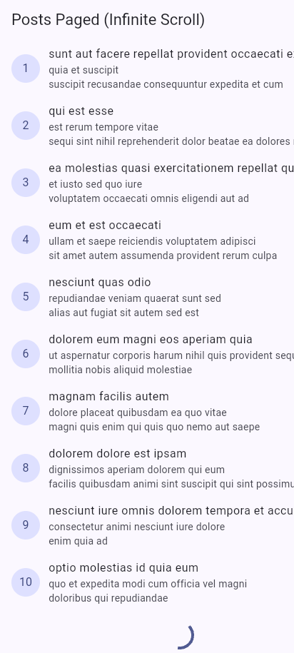
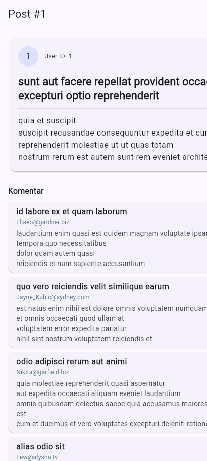
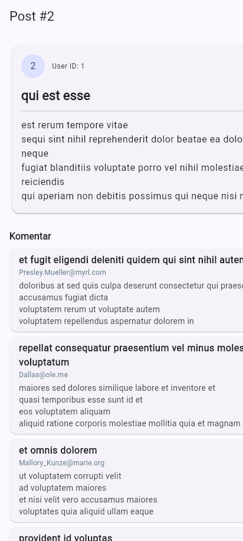

# #04 | Networking & REST API

**Mata Kuliah:** Pemrograman Mobile  
**Minggu:** 04  
**Topik:** HTTP, REST API, Null-Safe Serialization, Repository Pattern, Dio Client, Multistate UI (AsyncValue + Riverpod), Pagination (Infinite Scroll), & Testing  

---

## Identitas Mahasiswa

| Informasi | Keterangan |
|---|---|
| **Nama** | Yanuar Ramadhani Kuswoko |
| **NIM** | 244107020176 |
| **Kelas / Absen** | TI-2D / 25 |
| **Semester** | 5 |
| **Mata Kuliah** | Pemrograman Mobile |
| **Program Studi** | D-IV Teknik Informatika |
| **Jurusan** | Teknologi Informasi |
| **Institusi** | Politeknik Negeri Malang |

---

## 🎯 Tujuan Pembelajaran

Setelah menyelesaikan codelab dan praktikum pada minggu ke-4 ini, mahasiswa mampu:
1. Menjelaskan konsep protokol HTTP, arsitektur REST API, status code HTTP, dan format pertukaran data JSON.
2. Memetakan data JSON mentah ke dalam class model Dart (*serialization/deserialization*) secara defensif dan aman terhadap nilai `null` (*null-safe*).
3. Menerapkan **Repository Pattern** dasar sebagai pintu tunggal akses data agar lapisan UI terisolasi dari detail komunikasi jaringan.
4. Mengonfigurasi library **Dio** secara terpusat (konfigurasi *base URL*, *timeout*, dan interceptor logging) serta menangani exception jaringan (*DioException*).
5. Menampilkan antarmuka pengguna yang reaktif untuk menangani 4 state: *loading*, *error* (+ tombol *retry*), *empty*, dan *success* menggunakan `AsyncValue` dan `AsyncNotifier` pada ekosistem Flutter Riverpod.
6. Menerapkan teknik pagination dasar (*infinite scroll*) dengan mekanisme proteksi ganda (*guard*) untuk mencegah duplikasi pemanggilan request.
7. Menyusun unit test otomatis menggunakan repository palsu (*fake repository*) tanpa melakukan request HTTP sungguhan.
8. Menerapkan prinsip *Responsible AI* melalui **AI Challenge**, melakukan audit checklist verifikasi kode, dan mendokumentasikan perbaikan arsitektural.

---

## 📋 Checklist Tugas Mingguan

- [x] **Praktikum 1 — Dio dan Model Data:**
  - [x] Inisialisasi project `week4_api` dengan dependensi `dio` dan `flutter_riverpod`.
  - [x] Membuat model data `Post` dengan deserialisasi `fromJson` defensif dan `toJson` (`lib/data/models/post.dart`).
  - [x] Mengonfigurasi client Dio terpusat dengan base URL, timeout 10 detik, dan `LogInterceptor` (`lib/data/api_client.dart`).
  - [x] Membangun `PostRepository` sebagai *single source of truth* untuk mengambil data post (`lib/data/repositories/post_repository.dart`).
- [x] **Praktikum 2 — Provider dan Error Handling:**
  - [x] Membuat `PostListNotifier` (turunan `AsyncNotifier<List<Post>>`) dengan penanganan error otomatis (`lib/data/providers.dart`).
  - [x] Mengonfigurasi `postListProvider` dengan opsi `retry: (retryCount, error) => null` untuk stabilitas testing.
  - [x] Menyusun helper pengujian `readPostsOnce` dan `readPostsErrorOnce`.
  - [x] Membuat fungsi `friendlyErrorMessage` yang memetakan jenis error Dio (`timeout`, `connectionError`, `badResponse 404/401/403/500`) ke bahasa pengguna yang ramah.
  - [x] Membangun antarmuka `PostListPage` dengan 4 state: *loading* (`CircularProgressIndicator`), *error* (`friendlyErrorMessage` + *retry button*), *empty*, dan *success* (`RefreshIndicator` + `ListView.builder`).
  - [x] Mengonfigurasi root aplikasi dengan `ProviderScope` (`lib/main.dart`).
- [x] **Praktikum 3 — Pagination Dasar (Infinite Scroll):**
  - [x] Menambahkan method `fetchPostsPage({required int page, int limit = 10})` pada `PostRepository`.
  - [x] Mendefinisikan `PagedPostsState` dan `PagedPostsNotifier` (`lib/data/paged_posts.dart`) dengan guard ganda (`state.isLoadingMore || !state.hasMore`).
  - [x] Membangun `PagedPostPage` (`lib/pages/paged_post_page.dart`) menggunakan `ScrollController` yang memicu pemuatan halaman baru 200px sebelum ujung daftar.
  - [x] Menampilkan indikator loading di bawah daftar dan teks *"Semua data termuat."* saat seluruh data selesai diambil.
- [x] **AI Prompt Challenge & Verification Audit:**
  - [x] Menjalankan prompt pembuatan repository layer endpoint `GET /comments?postId={id}`.
  - [x] Mengimplementasikan model defensif `Comment`, `CommentRepository`, dan `comment_providers.dart`.
  - [x] Melakukan audit menyeluruh berdasarkan 6 kriteria *AI Verification Checklist*.
  - [x] Menyusun unit test untuk deserialisasi field hilang, payload kosong `{}` (*edge case*), serta provider testing (`test/comment_test.dart`).
  - [x] Mendokumentasikan log prompt, output raw AI, dan evaluasi teknis pada [docs/ai_challenge_log.md](docs/ai_challenge_log.md).
- [x] **Refactoring Challenge:**
  - [x] Mengekstrak baris post menjadi komponen mandiri `PostTile` (`lib/widgets/post_tile.dart`).
  - [x] Memindahkan `friendlyErrorMessage` ke file independen `lib/data/network_errors.dart` agar dapat digunakan ulang lintas modul.
  - [x] Mengintegrasikan `GoRouter` dengan rute utama `/` dan rute detail dinamis `/post/:id` (`lib/router.dart` dan `lib/pages/post_detail_page.dart`).
- [x] **Testing & Quality Assurance:**
  - [x] Membuat unit test `test/post_test.dart` dengan `FakePostRepository` untuk verifikasi parsing null-safe, mapping error jaringan, provider sukses, dan provider error.
  - [x] Membuat unit test `test/comment_test.dart` (6 pengujian lulus 100%).
  - [x] Memastikan kode lolos analisis statis tanpa warning (`flutter analyze`).
  - [x] Memastikan seluruh pengujian otomatis lulus 100% (`flutter test`).

---

## 📚 Rangkuman Teori & Konsep Kunci

### 1. HTTP, REST API, dan Status Code
HTTP (*Hypertext Transfer Protocol*) adalah protokol request–response tanpa status (*stateless*). Dalam arsitektur REST (*Representational State Transfer*), setiap operasi dipetakan ke resource melalui kata kerja HTTP:
- `GET`: Mengambil data (idempotent, tanpa efek samping).
- `POST`: Membuat data/resource baru.
- `PUT / PATCH`: Memperbarui seluruh/sebagian data resource.
- `DELETE`: Menghapus resource.

Respons server dikelompokkan berdasarkan status code:
- `2xx Success`: Permintaan berhasil diproses (misal `200 OK`, `201 Created`).
- `4xx Client Error`: Kesalahan dari sisi client/input (misal `400 Bad Request`, `401 Unauthorized`, `404 Not Found`).
- `5xx Server Error`: Kegagalan dari sisi server (misal `500 Internal Server Error`, `503 Service Unavailable`).

### 2. Deserialisasi JSON Defensif (*Null-Safe*)
JSON yang diterima dari jaringan berupa `Map<String, dynamic>`. Penggunaan *type casting* langsung seperti `json['title'] as String` rentan mengalami *runtime crash* (`type 'Null' is not a subtype of type 'String'`) apabila backend mengembalikan nilai `null` atau field dihilangkan. 

Pola defensif menggunakan *null-aware operator* dan fallback:
```dart
factory Post.fromJson(Map<String, dynamic> json) {
  return Post(
    userId: (json['userId'] as num?)?.toInt() ?? 0,
    id: (json['id'] as num?)?.toInt() ?? 0,
    title: json['title'] as String? ?? '',
    body: json['body'] as String? ?? '',
  );
}
```

### 3. Arsitektur Repository Pattern
Prinsip utama arsitektur bersih:
1. **UI tidak boleh memanggil client HTTP/Dio secara langsung.**
2. **Repository** bertanggung jawab sebagai pintu tunggal (*single source of truth*) yang mengisolasi detail jaringan dan mengubah respons mentah menjadi model domain.
3. **Provider (Riverpod)** mengelola siklus hidup data asinkron dan mengekspos `AsyncValue` ke UI.

```
┌─────────────────┐       watch / read       ┌────────────────────────┐
│ UI (PostListPage│ ◄─────────────────────── │ Provider (Riverpod)    │
│ & PostTile)     │                          │ (AsyncNotifier/State)  │
└─────────────────┘                          └───────────┬────────────┘
                                                         │ panggil
                                                         ▼
┌─────────────────┐       HTTP Request       ┌────────────────────────┐
│ REST API Server │ ◄─────────────────────── │ Repository Layer       │
│ (JSONPlaceholder│                          │ (PostRepository)       │
└─────────────────┘                          └───────────┬────────────┘
                                                         │ pakai
                                                         ▼
                                             ┌────────────────────────┐
                                             │ Centralized Dio Client │
                                             │ (Base URL, Timeout, Log│
                                             └────────────────────────┘
```

### 4. Dio vs Package HTTP
| Fitur | Package `http` | Package `dio` |
|---|---|---|
| **Konfigurasi Global** | Manual di setiap request | Terpusat melalui `BaseOptions` |
| **Timeout Handling** | Memerlukan `.timeout()` terpisah | Bawaan (`connectTimeout`, `receiveTimeout`) |
| **Interceptors** | Terbatas/perlu wrapper | Mendukung request/response/error interceptors |
| **Error Handling** | Mengembalikan error generik | Menghasilkan `DioException` dengan tipe terstruktur |

---

## 🏗️ Struktur Direktori Proyek

```text
04-week-4-networking-rest-api/
├── lib/
│   ├── main.dart                       # Entry point aplikasi + ProviderScope + GoRouter
│   ├── router.dart                     # Konfigurasi deklaratif GoRouter (/, /all, /post/:id)
│   ├── data/
│   │   ├── api_client.dart             # Konfigurasi Dio terpusat (BaseUrl, Timeout, Interceptor)
│   │   ├── network_errors.dart         # Helper pemetaan DioException ke pesan ramah pengguna
│   │   ├── providers.dart              # Providers Riverpod untuk Post & detail
│   │   ├── paged_posts.dart            # State & Notifier pagination (infinite scroll)
│   │   ├── comment_providers.dart      # Provider Riverpod untuk fitur Komentar (AI Challenge)
│   │   ├── models/
│   │   │   ├── post.dart               # Model Post dengan null-safe fromJson/toJson
│   │   │   └── comment.dart            # Model Comment dengan null-safe fromJson/toJson
│   │   └── repositories/
│   │       ├── post_repository.dart    # Repository untuk resource Posts
│   │       └── comment_repository.dart # Repository untuk resource Comments
│   ├── pages/
│   │   ├── post_list_page.dart         # Halaman daftar post (multistate UI)
│   │   ├── paged_post_page.dart        # Halaman daftar post paginated (infinite scroll)
│   │   └── post_detail_page.dart       # Halaman detail post (/post/:id) beserta komentar
│   └── widgets/
│       └── post_tile.dart              # Widget baris post modular hasil refactoring
├── test/
│   ├── post_test.dart                  # Unit test model Post, error mapping, & fake repo
│   └── comment_test.dart               # Unit test model Comment, edge cases, & comment provider
├── docs/
│   └── ai_challenge_log.md             # Dokumentasi log audit, prompt, & verifikasi AI
├── screenshots/                        # Tangkapan layar bukti eksekusi aplikasi
├── pubspec.yaml                        # Deklarasi dependensi (dio, flutter_riverpod, go_router)
└── README.md                           # Dokumentasi portofolio Minggu 4
```

---

## 🛠️ Refactoring & Best Practices

1. **Modularisasi Widget (`PostTile`):**
   - Baris item dalam `ListView` diekstrak ke dalam widget terpisah [`lib/widgets/post_tile.dart`](lib/widgets/post_tile.dart).
   - Meningkatkan keterbacaan kode halaman (*clean code*) dan memudahkan penulisan widget test.
2. **Pemisahan Logika Error Jaringan (`network_errors.dart`):**
   - Fungsi `friendlyErrorMessage` ditempatkan di [`lib/data/network_errors.dart`](lib/data/network_errors.dart).
   - Dapat diakses dan digunakan ulang secara konsisten di seluruh halaman aplikasi.
3. **Integrasi Navigasi GoRouter Dinamis (`/post/:id`):**
   - Menambahkan rute dinamis dengan pembacaan path parameter `state.pathParameters['id']`.
   - Mengambil data dari cache list provider jika sudah ada, atau melakukan query spesifik ke repository jika dibuka via direct link.

---

## 🤖 Ringkasan AI Challenge & Verification Audit

Log lengkap audit dan verifikasi tersimpan pada file [docs/ai_challenge_log.md](docs/ai_challenge_log.md).

- **Prompt yang Diberikan:** Pembuatan repository layer untuk endpoint `GET /comments?postId={id}` menggunakan Dio + Riverpod.
- **Hasil Audit:**
  - Deserialisasi awal AI masih menggunakan *direct cast* rawan crash $\rightarrow$ Diperbaiki dengan operator defensif `num?` dan `String? ?? ''`.
  - Dio diinstansiasi secara lokal $\rightarrow$ Diperbaiki agar menggunakan instansiasi sentral `dioProvider`.
  - Pengujian awal AI hanya menguji *happy path* $\rightarrow$ Ditambahkan pengujian *edge case* dengan payload `{}` kosong total serta pengujian error status dengan `FakeCommentRepository`.
- **Hasil Pengujian Otomatis:** 6/6 test pada `test/comment_test.dart` lulus 100%.

---

## 🧪 Panduan Menjalankan Aplikasi & Testing

### 1. Menjalankan Analisis Statis Kode
```bash
flutter analyze
```
*Output: `No issues found!`*

### 2. Menjalankan Seluruh Unit Test Otomatis
```bash
flutter test
```
*Output: `All tests passed! (10/10 tests passed)`*

### 3. Menjalankan Aplikasi di Perangkat / Emulator / Web / Desktop
```bash
flutter run
```

---

## 📸 Tangkapan Layar Aplikasi (Screenshots)

Berikut adalah bukti visual hasil eksekusi aplikasi mobile Flutter REST API:

| 1. Posts Paged (Infinite Scroll) | 2. Detail Post & Komentar (Post #1) | 3. Detail Post & Komentar (Post #2) |
|:---:|:---:|:---:|
|  |  |  |

---

## 💬 Jawaban Pertanyaan Refleksi

1. **Mengapa UI dilarang memanggil Dio langsung? Apa yang rusak jika aturan ini dilanggar?**
   - **Jawaban:** Jika UI memanggil Dio langsung, terjadi kopling ketat (*tight coupling*) antara lapisan antarmuka dengan detail implementasi jaringan (URL, header, interceptor, status code). Hal ini merusak prinsip *Separation of Concerns* (SoC), membuat kode UI sangat sulit diuji secara terisolasi (*unit testing*) tanpa koneksi internet sungguhan, menyulitkan penggantian pustaka HTTP di masa depan, serta menyebabkan duplikasi logika penanganan error di banyak tempat.

2. **Kapan pagination client-side cukup, dan kapan harus mengandalkan pagination server (`_page`/`_limit`)?**
   - **Jawaban:** 
     - *Client-side pagination* cukup digunakan jika dataset berukuran kecil dan tetap (misalnya $<100$ data statis), di mana seluruh payload data ringan diunduh sekali di awal dan proses pemotongan tampilan diatur oleh UI.
     - *Server-side pagination* (`_page` dan `_limit`) wajib digunakan ketika data berukuran besar (ratusan hingga jutaan data), data dinamis yang sering bertambah secara berkala, atau bandwidth/kuota jaringan terbatas, sehingga aplikasi hanya meminta data sesuai viewport pengguna dan menghemat memori perangkat.

3. **Bagaimana exception repository berubah menjadi `AsyncError` tanpa try/catch di setiap widget? Kapan try/catch eksplisit tetap dibutuhkan?**
   - **Jawaban:** 
     - Pada `AsyncNotifier` Riverpod, nilai kembalian method `build()` adalah `Future<T>`. Jika terjadi exception selama eksekusi method tersebut, Riverpod secara otomatis menangkap exception tersebut dan mengubah state provider menjadi `AsyncError(error, stackTrace)`. Widget kemudian cukup membaca `asyncValue.when(error: ...)` secara deklaratif.
     - *Try/catch eksplisit* tetap dibutuhkan saat melakukan aksi mutasi imperatif (misal: tombol aksi refresh manual, operasi `POST`/`DELETE` di mana kita ingin mengontrol transisi state secara terperinci atau menampilkan SnackBar error tanpa mengubah state utama).

4. **Bagian mana dari hasil AI yang Anda perbaiki, dan mengapa?**
   - **Jawaban:** 
     - *Null safety pada deserialisasi:* AI menghasilkan `json['name'] as String` yang berpotensi crash jika field hilang. Diperbaiki menjadi `json['name'] as String? ?? ''`.
     - *Sentralisasi Dio:* AI membuat instance `Dio()` baru di dalam class `CommentRepository`. Diperbaiki agar di-inject melalui `ref.watch(dioProvider)` untuk keseragaman interceptor dan kemudahan faking saat testing.
     - *Pengujian Edge Case:* AI hanya menyediakan satu pengujian sederhana. Diperluas dengan pengujian payload kosong total `{}` dan pengujian provider failure.

## 📖 Referensi Pendukung

1. [Slide Minggu 4: Networking & REST API](https://drive.google.com/open?id=1tqDg_xjU7V4kWlygn4Utxr9CdxmTu9wb&usp=drive_fs)
2. [Dio Package - pub.dev](https://pub.dev/packages/dio)
3. [JSONPlaceholder (Dummy REST API)](https://jsonplaceholder.typicode.com)
4. [Flutter Riverpod Documentation - AsyncNotifier & AsyncValue](https://riverpod.dev/docs/concepts/async_notifiers)
5. [Flutter Cookbook: Fetch Data from the Internet](https://docs.flutter.dev/cookbook/networking/fetch-data)
6. [Learn Dart in Y Minutes](https://learnxinyminutes.com/dart/)

---

*Laporan praktikum Minggu 04 disusun dengan standar integritas akademik dan verifikasi rekayasa perangkat lunak.*
