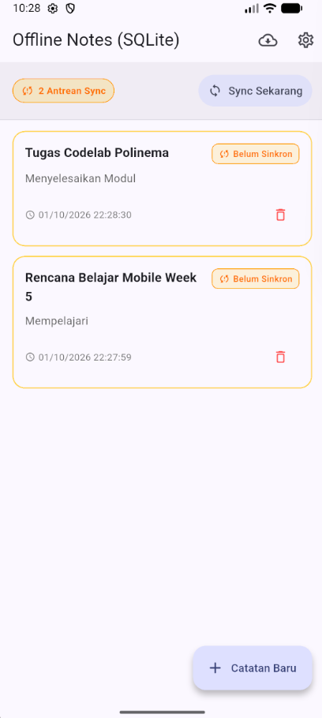
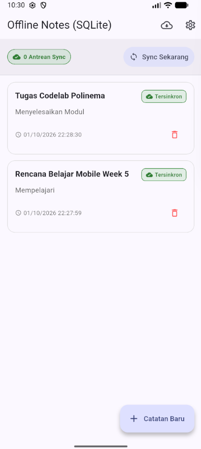

# #05 | Local Storage & Offline First

**Mata Kuliah:** Pemrograman Mobile  
**Minggu:** 05  
**Topik:** Local Storage (Key-Value & SQLite), Offline-First Architecture, Dirty Flag, Cache-First Read, Sync Queue, Refactoring, & Testing  

---

## Identitas Mahasiswa

| Informasi | Keterangan |
|---|---|
| **Nama** | Yanuar Ramadhani Kuswoko |
| **NIM** | 244107020176 |
| **Kelas / Absen** | TI-2D / 25 |
| **Semester** | 5 |
| **Mata Kuliah** | Pemrograman Mobile |
| **Program Studi** | D-IV Teknik Informatika |
| **Jurusan** | Teknologi Informasi |
| **Institusi** | Politeknik Negeri Malang |

---

## 🎯 Tujuan Pembelajaran

Setelah menyelesaikan codelab dan praktikum pada minggu ke-5 ini, mahasiswa mampu:
1. Menjelaskan perbedaan penyimpanan *key-value*, relasional (*SQLite*), dan *NoSQL* (*Hive*) di perangkat mobile.
2. Menyimpan dan mengelola preferensi sederhana (tema gelap/terang, *timestamp* terakhir dibuka) menggunakan **SharedPreferences** yang dipusatkan pada `PrefsRepository`.
3. Menerapkan operasi CRUD catatan (*notes*) persisten menggunakan **SQLite (`sqflite`)** melalui **Repository Pattern** lokal.
4. Menerapkan arsitektur dan pola **Offline-First**: *Cache-First Read*, penanda perubahan lokal (*dirty flag*), dan antrean sinkronisasi (*sync queue*).
5. Menampilkan antarmuka pengguna yang reaktif untuk menangani *multistate* (*loading*, *error*, *empty*, dan *success*) pada data lokal menggunakan **Riverpod** (`AsyncNotifier` & `AsyncValue`).
6. Menguji model dan *provider* secara independen menggunakan *fake repository* tanpa database SQLite sungguhan.

---

## 📋 Checklist Hasil Pengerjaan Praktikum (1–3)

- [x] **Praktikum 1 — SharedPreferences:**
  - [x] Inisialisasi project `week5_offline_notes` dengan dependensi `flutter_riverpod`, `shared_preferences`, `sqflite`, `path`, `dio`, dan `go_router`.
  - [x] Membuat `PrefsRepository` di `lib/data/prefs.dart` sebagai pintu tunggal akses key-value (`dark_mode` dan `last_opened_at`).
  - [x] Mengonfigurasi `prefsRepositoryProvider` dan `DarkModeNotifier` (`AsyncNotifierProvider<DarkModeNotifier, bool>`) di `lib/data/providers.dart`.
  - [x] Membuat antarmuka `SettingsPage` di `lib/pages/settings_page.dart` untuk switch tema gelap dan informasi waktu terakhir dibuka.
  - [x] Mencatat waktu buka aplikasi secara otomatis di `lib/main.dart` dengan `PrefsRepository().markOpenedNow()`.

- [x] **Praktikum 2 — SQLite dan Repository Catatan:**
  - [x] Membuat class model `Note` di `lib/data/local/note.dart` dengan atribut `id`, `title`, `body`, `updatedAt`, `dirty`, serta method serialisasi `toMap` & `fromMap` yang aman (*defensive*).
  - [x] Mengonfigurasi inisialisasi database SQLite di `lib/data/local/db.dart` (`openNotesDb`) dengan tabel `notes` dan `cached_posts`.
  - [x] Mengimplementasikan `NoteRepository` di `lib/data/repositories/note_repository.dart` dengan konstruktor *injectable* `openDb`, fungsi `fetchNotes` (urut `updated_at DESC`), `getNoteById`, `addNote`, `updateNote`, `deleteNote`, `countDirty`, dan `markAllSynced`.
  - [x] Membuat widget mandiri `NoteTile` di `lib/widgets/note_tile.dart` dengan *badge status* ("Belum Sinkron / dirty = 1" vs "Tersinkron / dirty = 0").
  - [x] Membangun halaman `NotesPage` di `lib/pages/notes_page.dart` dan `NoteDetailPage` di `lib/pages/note_detail_page.dart` yang berfungsi penuh dalam kondisi offline / mode pesawat.

- [x] **Praktikum 3 — Cache-First dan Antrean Sinkronisasi (Sync Queue):**
  - [x] Mengimplementasikan service sinkronisasi `SyncService` dan fungsi `syncNotes` di `lib/data/sync.dart`.
  - [x] Menerapkan pola *Cache-First Read* untuk data REST API (JSONPlaceholder `GET /posts`): membaca dari tabel SQLite `cached_posts` terlebih dahulu secara instan, kemudian melakukan background refresh dan menyimpan hasilnya.
  - [x] Menerapkan simulasi *Force Offline* (`forceOfflineProvider`) yang deterministik untuk demonstrasi dan testing tanpa bergantung Wi-Fi/koneksi fisik.
  - [x] Menampilkan badge antrean *dirty notes* yang otomatis ter-update dan tombol sinkronisasi dengan feedback *snackBar*.

- [x] **Refactoring Challenge:**
  - [x] Mengekstrak baris catatan menjadi widget mandiri `NoteTile` (`lib/widgets/note_tile.dart`) yang menampilkan badge status visual (*"Belum Sinkron / dirty = 1"* vs *"Tersinkron / dirty = 0"*).
  - [x] Memindahkan seluruh logika cache posts dan sinkronisasi `syncNotes` ke file independen `lib/data/sync.dart` sehingga `NoteRepository` tetap fokus pada operasi CRUD murni.
  - [x] Mengintegrasikan `GoRouter` (`lib/router.dart`) dengan rute dinamis `/note/:id` yang membaca catatan langsung dari repository lokal SQLite melalui `noteDetailProvider(id)`, bukan dari state list UI.

- [x] **AI Prompt Challenge & Verification Audit:**
  - [x] Menjalankan prompt komparasi storage (`SharedPreferences`, `Hive`, `sqflite`, `Drift`) untuk kebutuhan preferensi dan CRUD 1000+ catatan.
  - [x] Melakukan audit kritis berdasarkan *AI Verification Checklist* (menolak penempatan catatan di `SharedPreferences`, memvalidasi ketersediaan `dirty` flag & `updated_at`, dan mengevaluasi overhead dependensi).
  - [x] Menyusun dokumentasi lengkap, *raw AI prompt & response*, tabel perbandingan multi-kriteria, perbandingan skema DDL, dan justifikasi keputusan teknis pada [docs/ai_challenge_log.md](docs/ai_challenge_log.md).

- [x] **Testing & Quality Assurance:**
  - [x] Membuat unit test di `test/note_test.dart` menggunakan `FakeNoteRepository` (pengujian `fromMap` aman null, serialisasi *dirty flag*, provider sukses, provider error, dan `noteDetailProvider`).
  - [x] Membuat pengujian unit di `test/sync_and_prefs_test.dart` (model `Post`, antrean `syncNotes`, copyWith).
  - [x] Membuat pengujian widget di `test/widget_test.dart` (rendering `NoteTile` dan verifikasi badge dirty/clean).
  - [x] Seluruh 12 test lulus 100% (`flutter test`).
  - [x] Analisis statis bersih tanpa error / warning (`flutter analyze`).

---

## 🏆 Mini Project / Industry Challenge: Offline Notes Application

Aplikasi **Offline Notes** pada modul ini dibangun dengan memenuhi 7 kriteria industri:

1. **Preferensi Pengguna:** Pengaturan tema gelap/terang dan pencatatan waktu buka aplikasi (*last opened*) disimpan persisten pada `SharedPreferences` melalui `PrefsRepository`.
2. **CRUD Catatan SQLite Persisten:** Operasi Create, Read, Update, Delete berjalan di atas SQLite (`sqflite`), terurut berdasarkan waktu `updated_at DESC`, dan dikelola secara reaktif via Riverpod `AsyncNotifier`.
3. **Arsitektur Offline-First & Aturan Resolusi Konflik:**
   - **Data Bacaan:** Pola *Cache-First* menyajikan data lokal seketika, lalu menyegarkan dari REST API di latar belakang.
   - **Data Tulisan:** Setiap perubahan lokal diberi penanda `dirty = 1` dan antrean diproses via `syncNotes`.
   - **Aturan Konflik (*Conflict Resolution Rule*):** Diterapkan aturan eksplisit **Last-Write-Wins (LWW)** berbasis nilai ISO8601 pada kolom `updated_at`. Apabila terjadi pembaruan bersamaan, versi data dengan `updated_at` paling baru akan menimpa versi sebelumnya saat sinkronisasi.
4. **Pembuktian Mode Pesawat & Simulasi Offline:** Aplikasi tetap dapat membaca, menambah, dan mengedit catatan tanpa koneksi internet dengan badge antrean sync yang akurat.
5. **Pengujian Unit & Mocking:** Pengujian otomatis dijalankan menggunakan `FakeNoteRepository` yang mengisolasi pengujian dari basis data native sungguhan.
6. **AI Challenge & Justifikasi Teknis:** Audit perbandingan 4 storage telah didokumentasikan pada [`docs/ai_challenge_log.md`](docs/ai_challenge_log.md).
7. **Struktur Standar Repository:** Struktur folder rapi mencakup `lib/`, `test/`, `docs/`, `screenshots/`, dan `README.md`.

---

## 🛠️ Refactoring Challenge

1. **Ekstraksi `NoteTile` (`lib/widgets/note_tile.dart`):**
   - Komponen UI baris catatan dipisahkan dari `NotesPage` untuk meningkatkan reusabilitas dan modularitas.
   - Dilengkapi badge adaptif: warna amber/oranye untuk catatan kotor (*dirty*) dan warna hijau untuk catatan tersinkron.

2. **Isolasi Logika Sinkronisasi (`lib/data/sync.dart`):**
   - Menghindari *fat repository* dengan memisahkan `SyncService` dan helper `syncNotes` ke file `sync.dart`.
   - `NoteRepository` mempertahankan prinsip *Single Responsibility Principle* (SRP) untuk CRUD database SQLite saja.

3. **Routing Deklaratif GoRouter (`lib/router.dart`):**
   - Rute dinamis `/note/:id` memanfaatkan `noteDetailProvider(id)` untuk membaca data langsung dari database SQLite.
   - Memastikan data detail selalu akurat dan tidak bergantung pada *transient state* halaman daftar.

---

## ⚠️ Error Umum dan Solusinya

| Gejala Error | Penyebab Umum | Solusi Praktis |
|---|---|---|
| `MissingPluginException` untuk `shared_preferences` / `sqflite` | Hot restart dilakukan setelah menambahkan plugin native tanpa kompilasi ulang penuh (*full rebuild*). | Hentikan proses, lalu jalankan ulang aplikasi menggunakan perintah `flutter run` (bukan hot reload/restart). |
| `databaseException: table notes already exists` | Callback `onCreate` terpanggil ulang saat inisialisasi atau versi database tidak dinaikkan saat perubahan skema. | Naikkan parameter `version` dan implementasikan callback `onUpgrade`, atau uninstall/hapus data aplikasi pada perangkat uji saat development. |
| Badge *dirty* tidak pernah bernilai 0 | `markAllSynced()` tidak dipanggil atau dipanggil sebelum server merespons sukses. | Panggil `markAllSynced()` hanya setelah server merespons kode 2xx / simulasi selesai, dan verifikasi dengan `countDirty()`. |
| UI tidak otomatis *refresh* setelah mutasi catatan | Lupa melakukan invalidasi provider setelah operasi CRUD. | Lakukan invalidasi provider pada caller/notifier (`ref.invalidateSelf()` atau `state = await AsyncValue.guard(...)`), bukan di widget UI acak. |
| Test unit menyentuh database SQLite sungguhan | Pengujian memanggil `openNotesDb()` asli alih-alih database in-memory / mock. | Gunakan `FakeNoteRepository` via *provider overrides* (`noteRepositoryProvider.overrideWithValue(...)`) seperti yang diterapkan pada `test/note_test.dart`. |

---

## 💬 Refleksi

### 1. Mengapa daftar catatan tidak boleh disimpan di SharedPreferences? Apa yang rusak jika aturan ini dilanggar?
> **Jawaban:**  
> `SharedPreferences` dirancang khusus untuk menyimpan pasangan data primitif *key-value* berukuran kecil (seperti boolean tema, token, string setting). Jika daftar catatan disimpan di sana (misalnya sebagai satu string JSON raksasa):
> 1. **Performa Memburuk (*Heavy I/O*):** Setiap kali satu catatan ditambah, diubah, atau dihapus, seluruh daftar harus di-parse (*deserialized*), dimodifikasi di memori, dan ditulis ulang secara utuh (*serialized*) ke disk.
> 2. **Tidak Mendukung Query Parsial:** Tidak ada mekanisme pengurutan (`ORDER BY`), pencarian teks, filtering `dirty = 1`, atau *pagination* (`LIMIT/OFFSET`) di tingkat penyimpanan. Seluruh koleksi harus ditarik ke RAM.
> 3. **Rawan Kerusakan Data (*Data Race / Corruption*):** Operasi penulisan konkuren dapat menimpa data tanpa proteksi transaksi ACID seperti pada SQLite.

---

### 2. Kapan cache-first cukup, dan kapan Anda membutuhkan strategi lain (misalnya network-first untuk data harga real-time)?
> **Jawaban:**  
> - **Cache-First (Stale-While-Revalidate):** Sangat ideal untuk data yang jarang berubah (*semi-statis*), data yang tidak sensitif terhadap keterlambatan beberapa detik, atau konten konsumsi (artikel berita, daftar postingan, catatan pribadi, profil pengguna). Strategi ini memberikan waktu muat seketika (*instant UI*) dan memungkinkan aplikasi berfungsi tanpa internet.
> - **Network-First:** Wajib digunakan untuk data sensitif, dinamis, atau transaksional di mana keakuratan data real-time bersifat krusial, seperti data harga saham/kripto, ketersediaan kursi tiket penerbangan, transaksi perbankan, atau saldo dompet digital. Menampilkan data basi (*stale data*) pada skenario tersebut dapat menyebabkan salah ambil keputusan atau kerugian finansial.

---

### 3. Bagaimana dirty flag berubah menjadi antrean sync tanpa memblokir UI? Kapan antrean terpisah (tabel outbox) menjadi perlu?
> **Jawaban:**  
> - **Mekanisme Non-Blocking:** Kolom `dirty` (nilai `1` untuk data kotor / belum sinkron dan `0` untuk data bersih) memungkinkan operasi simpan lokal selesai secara instan di SQLite. Antrean sinkronisasi (`syncNotes`) dijalankan secara asinkron di latar belakang (*background task/async method*) tanpa menahan thread UI utama. UI hanya mengamati status progress melalui Riverpod `isSyncingProvider` atau `dirtyCountProvider`.
> - **Kebutuhan Tabel Outbox Terpisah:** Tabel antrean terpisah (*Transactional Outbox Pattern*) menjadi wajib ketika:
>   1. Terdapat operasi non-idempotent yang rumit (misal: urutan request `CREATE`, `UPDATE title`, `DELETE` pada entity yang sama).
>   2. Perlu mencatat metadata operasi: jenis HTTP method (`POST`, `PUT`, `DELETE`), endpoint tujuan, payload spesifik, jumlah percobaan ulang (*retry count*), dan log error jika gagal kirim.

---

### 4. Bagian mana dari rekomendasi AI yang Anda tolak, dan mengapa?
> **Jawaban:**  
> - **Penolakan Rekomendasi Drift untuk Proyek Skala Menengah/Kecil:** AI sempat menyarankan `Drift` karena fitur reaktivitas *stream* bawaannya. Rekomendasi ini **ditolak** untuk implementasi saat ini karena `Drift` membawa overhead *boilerplate* yang berat (`drift_dev`, `build_runner`, waktu build lebih lama). Kebutuhan reaktivitas pada `sqflite` sudah dapat dipenuhi dengan sangat bersih dan elegan menggunakan Riverpod `AsyncNotifier` dan `ref.invalidate`.
> - **Penolakan Opsi SharedPreferences untuk Koleksi:** Menolak tegas saran alternatif menyimpan array catatan dalam bentuk JSON string di SharedPreferences karena melanggar prinsip skalabilitas basis data mobile.

---

## 📁 Struktur Folder Project

```
05-week-5-local-storage-offline-first/
├── lib/
│   ├── main.dart                      # Root app, ProviderScope, Theme switcher, markOpenedNow
│   ├── router.dart                    # Konfigurasi GoRouter (/, /note/:id, /note/new, /settings, /cached-posts)
│   ├── data/
│   │   ├── local/
│   │   │   ├── db.dart                # Database helper & schema creation (notes, cached_posts)
│   │   │   └── note.dart              # Model Note dengan dirty flag & defensive serialization
│   │   ├── models/
│   │   │   └── post.dart              # Model Post untuk data REST API
│   │   ├── prefs.dart                 # PrefsRepository untuk key-value SharedPreferences
│   │   ├── sync.dart                  # SyncService, syncNotes queue, cache-first helper
│   │   ├── providers.dart             # Riverpod providers (prefs, notes, noteDetail, dirty count, cached posts)
│   │   └── repositories/
│   │       └── note_repository.dart   # NoteRepository CRUD SQLite
│   ├── pages/
│   │   ├── notes_page.dart            # Halaman utama daftar catatan + antrean sync + badge
│   │   ├── note_detail_page.dart      # Form view/tambah/edit catatan dari repository lokal
│   │   ├── settings_page.dart         # Pengaturan tema gelap & info waktu buka
│   │   └── cached_posts_page.dart     # Halaman demonstrasi Cache-First REST API
│   └── widgets/
│       └── note_tile.dart             # Widget item catatan dengan badge dirty
├── test/
│   ├── note_test.dart                 # Unit test model & provider dengan FakeNoteRepository
│   ├── sync_and_prefs_test.dart       # Test serialisasi, copyWith, dan syncNotes
│   └── widget_test.dart               # Widget test rendering NoteTile & dirty badge
├── docs/
│   └── ai_challenge_log.md            # Dokumentasi lengkap AI Challenge & Audit Storage
└── README.md
```

---

## 🚀 Cara Menjalankan Aplikasi & Testing

### 1. Menjalankan Analisis Statis
```bash
flutter analyze
```

### 2. Menjalankan Seluruh Unit Test
```bash
flutter test
```

### 3. Menjalankan Aplikasi
```bash
flutter run
```

---

## 📸 Tangkapan Layar Aplikasi (Screenshots)

Berikut adalah bukti visual hasil eksekusi aplikasi mobile Flutter Offline Notes & Local Storage pada emulator Android:

| 1. Catatan Offline (Belum Sinkron / `dirty = 1` / 2 Antrean Sync) | 2. Catatan Tersinkron (`dirty = 0` / 0 Antrean Sync) |
|:---:|:---:|
|  |  |

---

## 📖 Referensi Pendukung

1. [Slide Week 5: Local Storage & Offline First](https://jti-polinema.github.io/00-slides/Week_05_Local_Storage_Offline_First.html)
2. [Flutter cookbook: Store key-value data](https://docs.flutter.dev/cookbook/persistence/key-value)
3. [shared_preferences package](https://pub.dev/packages/shared_preferences)
4. [sqflite package](https://pub.dev/packages/sqflite)
5. [Hive package (alternatif NoSQL)](https://pub.dev/packages/hive)
6. [Drift package (alternatif reaktif)](https://pub.dev/packages/drift)
7. [Riverpod: AsyncNotifier dan AsyncValue](https://riverpod.dev/docs/concepts/async_notifiers)
8. [Learn Dart in Y Minutes](https://learnxinyminutes.com/dart/)
